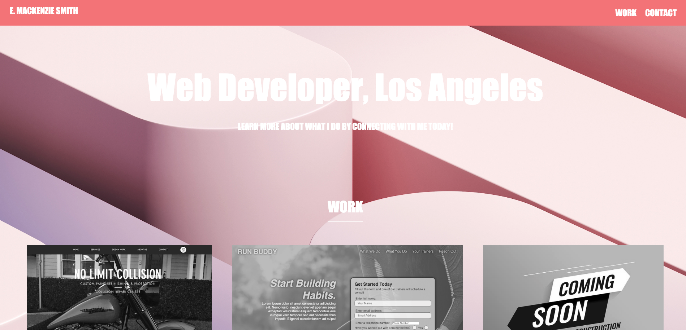
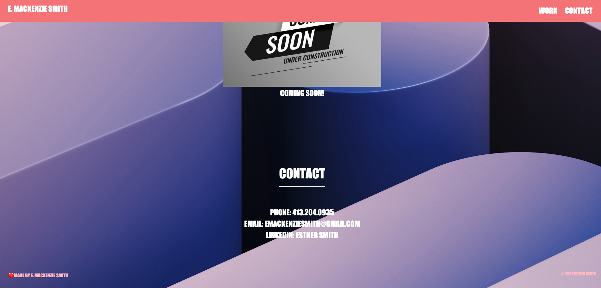

# Challenge 2: My Personal Portfolio

The purpose of this challenge was to put my CSS and HTML skills to the test by including flexbox, hover, etc. Overall, the design is basically what I had in mind, but I defintely need to fine-tune my skills to create the protfolio design I want. 

Deployed URL: https://emackenziesmith.github.io/

Files included: 
    1. index.html
    2. style.css
    3. gitignore
    4. images
        a. favicon-32x32.png
        b. background.jpg
        c. no-limit.png
        d. run-buddy.png
        3. under-construction.jpg
    
Distributor Info: emackenziesmith@gmail.com
GitHub: emackenziesmith

